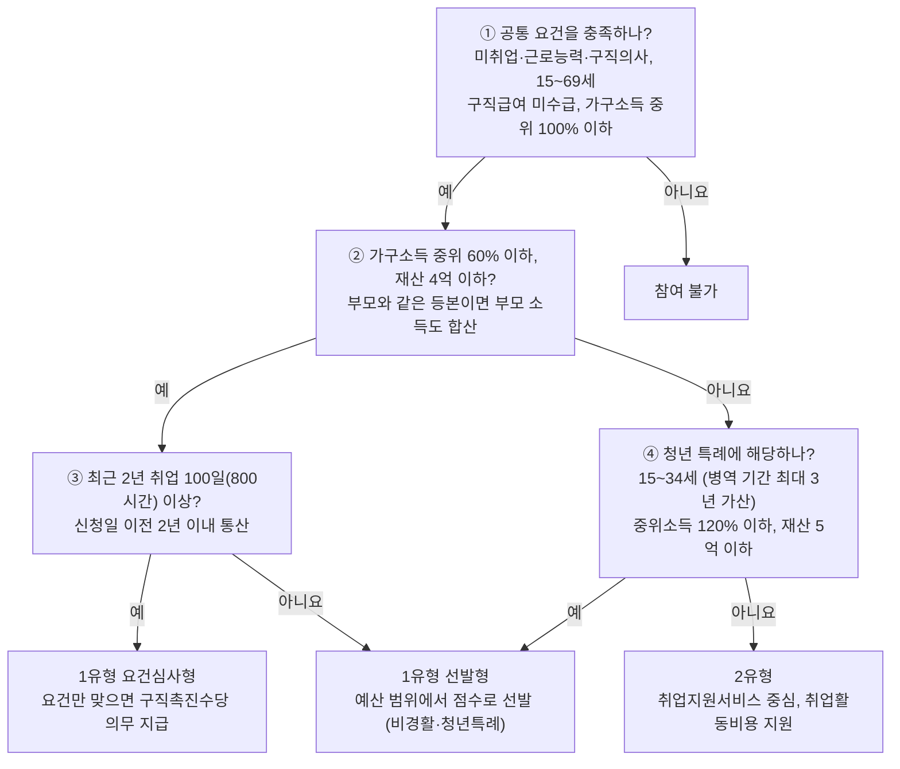

# 국민취업지원제도 상담사 코파일럿 기획서

작성일: 2026-09-29

## 배경과 문제

**결론: 만들 가치가 있습니다.** 상담사는 두껍고 해마다 바뀌는 매뉴얼을 뒤져 가며 답합니다. 그런데 가장 많이 받는 질문(수급자격)은 정형화되어 있어서 생성형 AI가 잘 도울 수 있습니다.

회의(2026-09-29)에서 확인한 사실은 다음과 같습니다.

- 상담사는 구직자가 내방하거나 전화로 문의하면 「국민취업지원제도 업무매뉴얼(2026.1)」을 근거로 답합니다.
- 신입뿐 아니라 1~2년 차도 매뉴얼을 자주 찾아봅니다. **매년 바뀌는 부분이 많고**, 전부 숙지하기 어렵기 때문입니다.
- 상담 흐름은 정형화되어 있습니다. 나이 → 가구 소득 → 재산 → 세대 분리 여부(등본) → 취업·알바 경험 → 희망 직종 순으로 묻고 1·2유형을 판정합니다.
- 핵심은 가능하면 **1유형으로 안내하는 것**입니다(예: 세대 분리 안내). 올해는 2유형 수당이 크게 줄었습니다.
- 신입은 *어떤 질문을 다음에 해야 하는지* 모르는 것이 가장 큰 어려움입니다. 10년 차의 질문 순서를 알지 못합니다.
- 매뉴얼로 풀리지 않는 영역도 있습니다. 라포 형성, 기업 알선·매칭(인센티브의 핵심), 고용센터(지역)별 해석 차이(팀장이 문의해서 결정)가 여기에 해당합니다.

## 타깃 사용자와 핵심 질문

1순위 사용자는 **신입~2년 차 상담사**이고, 질문의 대부분은 **수당 수급자격**에 몰려 있습니다.

| 사용자 | 상황 | 필요한 것 |
| --- | --- | --- |
| 신입 상담사 | 교육을 받아도 부족하고, 내가 한 말이 맞는지 매뉴얼로 다시 확인한다 | 다음에 물어볼 질문, 근거 조항 |
| 1~2년 차 상담사 | 기본은 알지만 특이 유형과 올해 바뀐 내용이 헷갈린다 | 빠른 조항 검색, 전년 대비 변경점 |
| 팀장 | 애매한 건을 고용센터에 문의해서 결정한다 | 센터별 해석을 기록하고 공유 (Phase 2) |

회의에서 나온 자주 묻는 질문은 다음과 같습니다.

- 이 참여자가 수당(구직촉진수당)을 받을 수 있는 요건이 되나?
- 사업소득·불로소득이 얼마 있는데 수당을 받을 수 있나?
- 1유형 중 특이 유형이 올해부터 바뀌었나? (전년 대비 변경점)
- 취업처에 따라 취업성공수당이 어떻게 달라지나?

현업에서 실제로 자주 받는 질문 목록(10~20개)을 더 받아야 합니다. 평가 세트로 쓸 예정입니다.

## 솔루션 개요와 MVP 범위

상담사 전용 웹 도구 **‘상담사 코파일럿’**을 만듭니다. 1차 MVP는 매뉴얼만으로 바로 만들 수 있는 **A(매뉴얼 Q&A)와 B(수급자격 판정 가이드)** 두 가지입니다. 구직자는 화면을 보지 않고, 상담사만 봅니다.

| 구분 | 기능 | 단계 |
| --- | --- | --- |
| A | 매뉴얼 Q&A: 자연어로 물으면 답변과 근거 조항 원문을 보여준다 | MVP |
| B | 수급자격 판정 가이드: 다음에 물어볼 질문을 제시하고 1·2유형을 예상 판정한다 | MVP |
| C | 실시간 음성 인식(STT)으로 상담 중에 다음 질문을 띄우고, 신입이 가상 구직자와 롤플레이로 연습한다 | Phase 2 |
| D | 전년도 매뉴얼과 비교해 변경점을 안내한다 | Phase 2 (2025 매뉴얼 확보 시 즉시) |
| E | 센터별 해석 FAQ: 팀장이 문의 결과를 입력하고 공유한다 | Phase 2 |

라포 형성과 기업 알선·매칭은 이번 범위에서 제외합니다. 매뉴얼에 없는 영역이고 별도 데이터(구인 정보)가 필요합니다.

## 주요 기능 상세

두 기능 모두 **답변마다 매뉴얼 원문 근거를 붙이고, 매뉴얼에 없는 내용은 추측하지 않는다**는 원칙을 따릅니다.

### A. 매뉴얼 Q&A

1. 상담사가 자연어로 질문한다. (예: “사업소득이 월 200만 원인데 참여할 수 있나요?”)
2. 시스템은 결론을 먼저 답하고, 근거 조항 원문을 인용한다. 위치는 “Part 02 수급자격 > Ⅰ 수급자격 요건 > 1. 공통 요건”처럼 표시한다.
3. 매뉴얼에 근거가 없거나 센터별 해석이 갈리는 사항은 **“팀장 확인 필요”**로 표시한다.
4. 추천 질문 칩을 제공한다. (1유형 요건, 청년 연령과 병역 가산, 졸업예정자 참여 시기, 취업성공수당 등)

### B. 수급자격 판정 가이드

상담사가 구직자의 답을 하나씩 입력하면, 시스템이 **다음에 물어볼 질문과 그 이유**를 제시합니다. 판정 기준은 매뉴얼 Part 02를 그대로 따릅니다.

| 확인 항목 | 상담사가 묻는 질문 | 매뉴얼 기준(2026) |
| --- | --- | --- |
| 연령 | 나이가 어떻게 되세요? (남성은 군 복무 기간도) | 15~69세. 청년은 15~34세이고 병역 기간을 최대 3년까지 더한다 |
| 취업 상태 | 지금 일하고 계세요? 학교나 군 복무 중이세요? | 미취업자. 주 30시간 미만 근로자와 월 250만 원 미만 소득자는 참여 가능 |
| 가구 소득 | 등본상 가구원은 몇 명이고, 가구 월소득은 얼마인가요? | 1유형은 중위소득 60% 이하(청년 120% 이하). 1인 가구 중위소득은 2,564,238원 |
| 재산 | 가구 재산은 얼마인가요? | 4억 원 이하(청년 5억 원 이하) |
| 취업 경험 | 최근 2년 동안 일하거나 알바한 기간은 얼마인가요? | 100일(또는 800시간) 이상이면 요건심사형, 미만이면 선발형 |
| 제한 사유 | 구직급여를 받고 계세요? 이전에 참여한 적이 있나요? | 구직급여를 받는 중이면 참여 불가. 종료된 뒤 3년이 지나야 재참여 가능 |

②에서 부모 소득이 합산돼 기준을 넘으면, 가이드가 세대 분리를 검토하라고 안내합니다. 1유형으로 갈 수 있는 가장 흔한 경로입니다.

판정 결과는 “1유형 요건심사형 / 1유형 선발형 / 2유형 / 참여 불가” 중 하나의 **예상 판정**과 근거로 보여줍니다. 1유형에 조금 못 미치는 경우에는 전환할 수 있는 방법도 안내합니다. (예: 부모와 같은 등본이라 가구 소득이 초과하면 세대 분리를 검토하도록 안내) 최종 판정은 항상 상담사가 합니다. 구직자 개인정보는 저장하지 않습니다.

## 데이터와 기술 설계

매뉴얼 HWPX 파일은 PDF로 변환하지 않고 **직접 파싱할 수 있습니다**. 본문 분량이 약 16만 자여서, 검색 DB 없이 매뉴얼 전체를 AI에 한 번에 넣는 방식으로 시작합니다.

| Part | 내용 | 본문(자) | 표(개) |
| --- | --- | --- | --- |
| 01 | 국민취업지원제도 개괄 | 약 3천 | 14 |
| 02 | 수급자격 | 약 3.3만 | 83 |
| 03 | 취업지원서비스 | 약 7.6만 | 220 |
| 04 | 수당 지급 | 약 2.3만 | 68 |
| 05 | 부정수급 업무처리 | 약 2.1만 | 34 |
| 06 | 조건부수급자 운영지침 | 약 4천 | 11 |
| 07 | 청년 빈일자리 특화 프로그램 | 약 4천 | 27 |

파싱할 때 주의할 점은 세 가지입니다.

- **표가 많다(460여 개).** 중위소득표, 선발형 배점표 등 핵심 기준이 표에 있어서, 병합 셀까지 살려 표 형태로 변환해야 한다.
- **도식이 이미지다(300여 개).** 업무 프로세스 그림은 AI 이미지 인식으로 설명문을 만들어 본문에 넣는다(주요 이미지만).
- **쪽 번호가 없다.** 근거는 “Part > 장 > 절” 경로로 표시하고, 본문의 “25p 참고” 같은 표기는 보조로 쓴다.

| 구성 요소 | 선택 | 이유 |
| --- | --- | --- |
| 매뉴얼 변환 | Python으로 HWPX(XML)를 마크다운으로 변환 | 한글 프로그램 없이 자동 변환할 수 있고, 매년 새 매뉴얼도 바로 넣을 수 있다 |
| AI 모델 | Claude API (Sonnet 5.5 기본, 필요하면 Opus 5.5) | 한국어 성능과 긴 문서 처리, 인용 기능이 좋다 |
| 검색 방식 | 매뉴얼 전체를 컨텍스트에 넣고 프롬프트 캐시 적용 | 구현이 단순하고 누락이 없다. 캐시로 비용과 속도를 줄인다 |
| 화면 | Streamlit 웹 앱 (Q&A 탭, 판정 가이드 탭) | 1주 안에 시연 가능한 수준으로 빠르게 만들 수 있다 |
| 확장 | 전년도 매뉴얼 등 문서가 늘면 섹션 단위 검색(RAG)으로 전환 | 컨텍스트 한도와 비용에 대비한다 |

구직자 개인정보(소득, 주소 등)는 저장하지 않습니다. 판정 가이드에는 이름 없이 수치만 입력합니다.

## 일정, 성공 지표, 리스크

기획이 확정되면 **약 1주(영업일 6일) 안에 상담사에게 시연**할 수 있습니다.

1. D+0: 이 기획서를 회의에서 검토하고, 현업 질문 목록을 받는다.
2. D+1~2: 매뉴얼을 마크다운으로 변환하고, 표와 누락 글자를 원본과 대조한다.
3. D+3~4: 기능 A(매뉴얼 Q&A)와 평가 세트 20문항을 만든다.
4. D+5~6: 기능 B(판정 가이드)와 화면을 만들고 상담사에게 시연한다.

| 성공 지표 | 목표 | 측정 방법 |
| --- | --- | --- |
| 답변과 근거의 정확도 | 20문항 중 18문항 이상 정답 | 현업 상담사가 검수 |
| 매뉴얼 탐색 시간 | 기존 대비 단축 | 같은 질문을 매뉴얼과 도구로 각각 찾아보고 시간 비교 |
| 신입 상담사 만족도 | “다시 쓰겠다” 응답 과반 | 시연 후 설문 |

| 리스크 | 대응 |
| --- | --- |
| AI가 틀린 기준을 답함 | 모든 답변에 원문을 인용하고, 최종 판단은 상담사가 한다 |
| 센터(지역)별 해석이 다름 | “팀장 확인 필요”로 표시하고, Phase 2에서 센터별 FAQ를 쌓는다 |
| 표·도식 변환 오류 | 핵심 표(중위소득, 선발형 배점)를 원본과 대조해 검수한다 |
| 개인정보 | 구직자 정보를 저장하지 않고, 이름 없이 수치만 다룬다 |
| 매년 매뉴얼 개정 | 새 HWPX를 넣으면 자동으로 다시 변환되도록 만든다 |

## 내일 회의에서 결정하고 확인할 것

- [ ] MVP 범위를 A(매뉴얼 Q&A)와 B(판정 가이드)로 확정할지
- [ ] 현업에서 자주 받는 질문 10~20개와 정답 받기 (평가 세트)
- [ ] 2025년 매뉴얼 파일을 구할 수 있는지 (전년 대비 변경점 기능)
- [ ] 시연과 검수를 맡아줄 현업 상담사(신입 1명, 경력 1명) 정하기
- [ ] “팀장 확인 필요”로 분류할 대표 사례(예: 사업소득 인정 범위) 수집
- [ ] Phase 2(음성 인식 질문 추천, 신입 롤플레이 연습)의 우선순위
